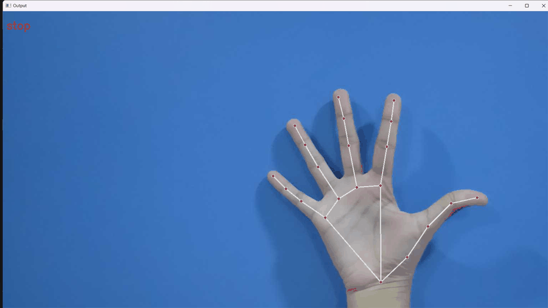

# Hand Gesture Music Control (MediaPipe + TensorFlow + OpenCV)


[](https://github.com/jambhaleAnuj/Music-control-with-hand-gesture-recognition/actions/workflows/ci.yml)
[](https://github.com/jambhaleAnuj/Music-control-with-hand-gesture-recognition/actions/workflows/codeql.yml)

Control your music player using hand gestures in real time. This project combines MediaPipe hand landmarks with a TensorFlow/Keras gesture classifier and OpenCV to recognize gestures like thumbs up/down, fist, and palm to play, pause, stop, or resume music.

Keywords: hand gesture recognition, mediapipe hands, tensorflow keras, opencv python, computer vision, music control, real-time inference, pygame audio.

---

## Demo

Add a short screencast or GIF here showing gestures controlling the music.




---

## Features

- Real-time hand landmark detection with MediaPipe
- TensorFlow/Keras gesture classifier (SavedModel)
- OpenCV-based webcam capture
- Hands-free music control via pygame.mixer
- Simple, single-file script that’s easy to extend

## Project structure

```text
hand_gesture_music_control.py   # Main script (run this)
mp_hand_gesture/                # Trained TensorFlow SavedModel
assets/config/gesture.names     # Class label list used by the model
assets/audio/METAMORPHOSIS.mp3  # Example audio file (replace with your own)
assets/config/data.pickle       # (Optional) Training data artifact if you have it
```
Recommended structure (clean root):

```text
.github/                        # Workflows, templates, policies
assets/
	audio/                        # MP3s and audio assets
	config/                       # Config files (optionally gesture.names)
docs/                           # Screenshots, demo gif, meta docs
	meta/                         # Roadmap, Changelog
mp_hand_gesture/                # Trained TensorFlow SavedModel
hand_gesture_music_control.py   # Main script
requirements.txt                # Dependencies
README.md, LICENSE
```

## Requirements

- Python 3.10
- A webcam
- An audio output device

Python packages are pinned in `requirements.txt`:

- tensorflow==2.13.1, keras==2.13.1
- mediapipe, opencv-python, numpy, pygame

## Quick start

1) Create and activate a virtual environment
2) Install dependencies
3) Run the script

Windows (PowerShell):

```powershell
python -m venv .venv
.\.venv\Scripts\Activate.ps1
pip install --upgrade pip
pip install -r requirements.txt
python hand_gesture_music_control.py
```

macOS/Linux:

```bash
python3 -m venv .venv
source .venv/bin/activate
python -m pip install --upgrade pip
python -m pip install -r requirements.txt
python hand_gesture_music_control.py
```

## Usage tips

- Webcam source: the script uses `source` for video input. To use your default webcam, set `source = 0` in `hand_gesture_music_control.py`. To use an IP camera app, set `source` to its URL (often ending with `/video`).
- Replace `METAMORPHOSIS.mp3` with your own audio file to avoid copyright issues.
- Ensure adequate lighting and keep your hand inside the frame for best results.

### Gesture mapping (from `gesture.names`)

| Gesture     | Action             |
|-------------|--------------------|
| thumbs up   | play (if stopped)  |
| thumbs down | stop               |
| fist        | resume (if paused) |
| stop        | pause              |
| live long   | pause              |

Other classes included for experimentation: `okay`, `peace`, `call me`, `rock`, `smile`.

## How it works

1. MediaPipe detects 21 hand landmarks per frame.
2. Landmark coordinates are fed into a TensorFlow/Keras model (`mp_hand_gesture`).
3. The predicted class controls playback via `pygame.mixer`.

## Troubleshooting

- Camera doesn’t open: set `url = 0` for the default webcam. If you use an IP camera app, verify the URL.
- No sound: check your system audio device and `pygame.mixer` initialization; try a different `.mp3`.
- TensorFlow install is slow or fails on CI: CI in this repo only runs style checks to stay light-weight.
- Import errors on Apple Silicon: prefer Python 3.10 and CPU-only TensorFlow. Check TF’s official install guide.

## Contributing

Contributions are welcome! Please read [CONTRIBUTING](.github/CONTRIBUTING.md) and our [CODE OF CONDUCT](.github/CODE_OF_CONDUCT.md).

## License

This project is licensed under the MIT License — see `LICENSE` for details.

See also: [Roadmap](docs/meta/ROADMAP.md) · [Changelog](docs/meta/CHANGELOG.md)

## Acknowledgements & References

- [MediaPipe Hands](https://developers.google.com/mediapipe/solutions/vision/hands)
- [MediaPipe Gesture Recognizer](https://developers.google.com/mediapipe/solutions/vision/gesture_recognizer)
- [Gesture Recognizer (Python)](https://developers.google.com/mediapipe/solutions/vision/gesture_recognizer/python)
- [OpenCV](https://opencv.org/)
- [TensorFlow/Keras](https://www.tensorflow.org/)
- [Tutorial inspiration](https://www.geeksforgeeks.org/face-and-hand-landmarks-detection-using-python-mediapipe-opencv/)

---

If this project helped you, consider starring ⭐ the repo and sharing it!

